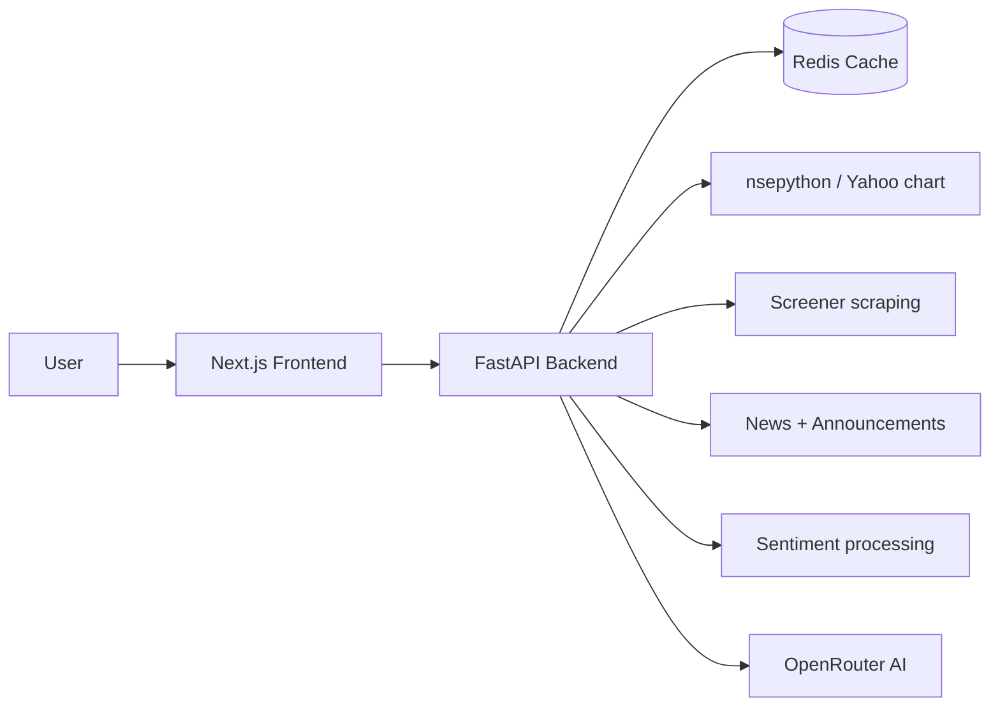

# Stocxi

<p align="center">
	
</p>

<p align="center">
	
	
	
	
	
</p>

Stocxi is a full-stack stock analysis app for Indian markets (NSE/BSE).
It combines market data, financials, technical indicators, news, social sentiment, and AI-generated decision support into one beginner-friendly workflow.

## What This Project Does

- Fast symbol search for Indian stocks.
- Stock overview with price, 52-week range, key ratios, and technical indicators.
- Financial statements from Screener data (P&L, balance sheet, cash flow, shareholding, MF holdings).
- News and announcements aggregation.
- Social sentiment signal from Reddit and X/Twitter feed processing.
- AI analysis endpoint that returns Buy / Hold / Avoid with reasoning.
- Redis caching for faster repeated calls.

## Product Flow

1. User opens the frontend and searches a symbol.
2. Frontend calls backend APIs.
3. Backend checks Redis cache first.
4. On cache miss, backend fetches live/source data from service layers.
5. Data gets normalized and returned to frontend.
6. AI analysis and report endpoints generate decision summaries.

## Architecture



## Tech Stack

| Layer | Stack |
|---|---|
| Frontend | Next.js 16, React 19, TypeScript, NextAuth |
| Backend | FastAPI, Python 3.11 |
| Data sources | nsepython, yfinance, Screener scraping, RSS/API feeds |
| Technicals | pandas + ta |
| Cache | Redis (Upstash compatible) |
| AI | OpenRouter via OpenAI-compatible SDK |
| Deployment | Vercel (frontend + backend as separate projects) |

## Repository Layout

```text
stocxi/
├── backend/
│   ├── main.py
│   ├── config.py
│   ├── routers/
│   ├── services/
│   ├── cache/
│   ├── requirements.txt
│   └── .env.example
├── frontend/
│   ├── app/
│   ├── components/
│   ├── lib/
│   ├── package.json
│   └── .env.example
├── config/
└── README.md
```

## Local Setup and Run

### Prerequisites

- Python 3.11+
- Node.js 20+
- npm 10+
- Redis URL (Upstash rediss URL recommended)
- OpenRouter API key

### 1) Backend Setup

```bash
cd backend
python3 -m venv .venv
source .venv/bin/activate
pip install -r requirements.txt
cp .env.example .env
```

Edit backend .env values:

```env
REDIS_URL=rediss://:YOUR_PASSWORD@YOUR_ENDPOINT.upstash.io:6379
OPENROUTER_API_KEY=sk-or-v1-YOUR_KEY_HERE
ALLOWED_ORIGINS_RAW=*
ENVIRONMENT=development
```

Run backend:

```bash
uvicorn main:app --reload --port 8000
```

### 2) Frontend Setup

```bash
cd ../frontend
npm install
cp .env.example .env.local
```

Edit frontend .env.local values:

```env
NEXT_PUBLIC_API_URL=http://localhost:8000
NEXTAUTH_URL=http://localhost:3000
NEXTAUTH_SECRET=replace_with_long_random_secret
REDIS_URL=rediss://:YOUR_PASSWORD@YOUR_ENDPOINT.upstash.io:6379
GOOGLE_CLIENT_ID=
GOOGLE_CLIENT_SECRET=
```

Run frontend:

```bash
npm run dev
```

Open app:

- Frontend: http://localhost:3000
- Backend docs: http://localhost:8000/docs
- Health check: http://localhost:8000/health

## API Endpoints

| Method | Endpoint | Purpose |
|---|---|---|
| GET | /health | Liveness + Redis connectivity |
| GET | /api/v1/search?q=tcs&limit=10 | Symbol autocomplete |
| GET | /api/v1/stock/{symbol} | Stock overview |
| GET | /api/v1/stock/{symbol}/financials | Financial statements |
| GET | /api/v1/stock/{symbol}/news | News feed |
| GET | /api/v1/stock/{symbol}/sentiment | Social sentiment |
| GET | /api/v1/stock/{symbol}/history?period=1y | Historical chart data |
| GET | /api/v1/stock/{symbol}/announcements | Corporate announcements |
| GET | /api/v1/analysis/{symbol}?risk_level=medium | AI analysis |
| GET | /api/v1/analysis/{symbol}/report | Downloadable report |

## Deployment (Vercel)

Deploy as two separate Vercel projects from the same repository:

1. Backend project with Root Directory set to backend.
2. Frontend project with Root Directory set to frontend.
3. Set backend and frontend environment variables in each project.
4. Point frontend NEXT_PUBLIC_API_URL to backend Vercel URL.
5. Lock backend ALLOWED_ORIGINS_RAW to frontend domain in production.

## Troubleshooting

### Frontend npm run dev fails

- Run npm install inside frontend again.
- Verify Node version (node -v), use Node 20+.
- Make sure frontend .env.local exists and NEXT_PUBLIC_API_URL is set.

### Backend startup fails

- Activate backend virtual environment.
- Reinstall deps: pip install -r requirements.txt
- Confirm backend .env has REDIS_URL and OPENROUTER_API_KEY.

### CORS error in browser

- In local development, keep ALLOWED_ORIGINS_RAW=*.
- In production, set ALLOWED_ORIGINS_RAW to exact frontend URL.

### Redis connection issues

- Verify REDIS_URL starts with rediss://
- Check password/host/port in Upstash console.

## Notes

- This project is for educational and product-building purposes.
- It is not financial advice and not a SEBI-registered advisory service.
