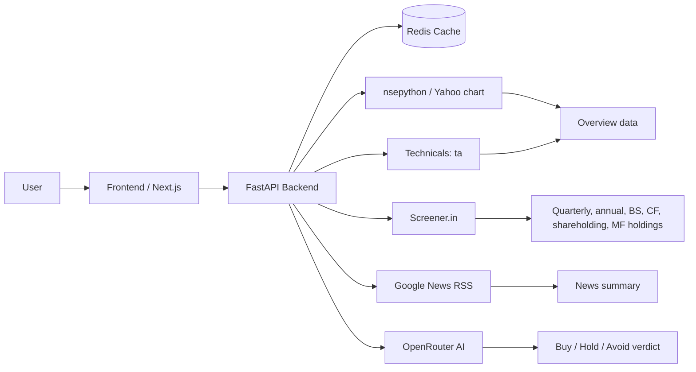

# Stocxi

AI-powered Indian stock analysis with a clean, beginner-friendly interface and a backend that actually explains what it’s seeing.


## Showcase

| Sticker | What it means |
|---|---|
| 📌 Fast search | Find NSE/BSE symbols quickly |
| 📈 Full context | Price, fundamentals, technicals, financials, news |
| 🤖 AI verdict | Buy / Hold / Avoid with plain-English reasoning |
| 🧠 Risk-aware | Low / medium / high risk profiles supported |
| ⚡ Cached | Redis-backed hot paths for repeat requests |

## Why It Exists

Most stock tools are either too noisy for beginners or too shallow for real decisions. Stocxi sits in the middle: search a stock, inspect the data that matters, and get a concise AI readout without needing to decode the market jargon yourself.

## System Map



## What’s Built

- Search any NSE/BSE stock symbol.
- View stock overview with price, 52-week range, change, and technical indicators.
- Read quarterly and annual financials, balance sheet, cash flow, and shareholding.
- See mutual fund holdings when Screener exposes them.
- Read recent news and corporate announcements.
- Ask the AI for a risk-aware Buy / Hold / Avoid verdict.
- Keep hot data fast with Redis caching.

## Current Status

The backend is complete and verified in this workspace. The repo currently contains the FastAPI backend, services, routers, cache layer, and testing docs. The frontend is planned in the docs but is not present in this workspace yet.

## Tech Stack

| Layer | Technology |
|---|---|
| Backend | FastAPI, Python 3.11 |
| Price / fundamentals | nsepython, Yahoo chart fallback |
| Financial statements | Screener.in scraping |
| Technical indicators | `ta` on OHLCV data |
| News | Google News RSS, yfinance fallback |
| AI analysis | OpenRouter + Claude-compatible models |
| Cache | Upstash Redis |
| Deployment target | Vercel frontend, Cloudflare Tunnel backend |

## API Snapshot

| Method | Endpoint | Purpose |
|---|---|---|
| GET | `/api/v1/stock/{symbol}` | Overview: price, fundamentals, technicals |
| GET | `/api/v1/stock/{symbol}/financials` | Quarterly, annual, balance sheet, cash flow, shareholding, MF holdings |
| GET | `/api/v1/stock/{symbol}/news` | Recent news headlines |
| GET | `/api/v1/stock/{symbol}/announcements` | Corporate announcements |
| GET | `/api/v1/analysis/{symbol}` | AI verdict with risk profile |
| GET | `/api/v1/search?q={query}` | Stock autocomplete |

## Cache TTLs

| Data | TTL |
|---|---|
| Stock overview | 5 minutes |
| Financials | 7 days |
| News | 2 hours |
| Announcements | 2 hours |
| AI analysis | 6 hours |
| Search | 1 hour |

## Data Flow

1. User searches a stock symbol.
2. Backend checks Redis first.
3. On cache miss, services fetch live data.
4. Results are merged and normalized.
5. The response is cached and returned.
6. AI analysis is generated on demand and cached separately.

## Setup

### Backend

```bash
cd backend
python -m venv venv
source venv/bin/activate
pip install -r requirements.txt
uvicorn main:app --reload --port 8000
```

### Environment Variables

Create `backend/.env`:

```env
OPENROUTER_API_KEY=your_key_here
UPSTASH_REDIS_URL=your_upstash_url
UPSTASH_REDIS_TOKEN=your_upstash_token
ALLOWED_ORIGINS=http://localhost:3000,https://stocxi.vercel.app
```

## Project Layout

```text
stocxi/
├── backend/
│   ├── main.py
│   ├── routers/
│   ├── services/
│   ├── cache/
│   └── test_services.py
├── ARCHITECTURE.md
├── REQUIREMENTS.md
├── PROGRESS.md
├── AI_CONTEXT.md
└── DATAFLOW.md
```

## Notes

- `PROGRESS.md` tracks implementation status.
- `backend/TESTING.md` records the current verified behavior and edge-case checks.
- This project is for educational purposes only and is not SEBI registered. It is not financial advice.
